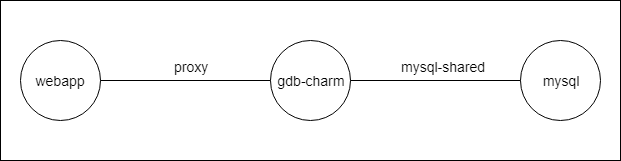
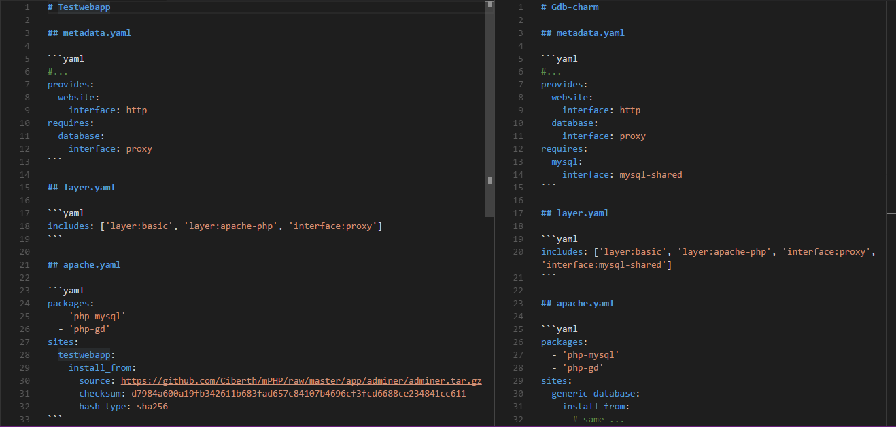
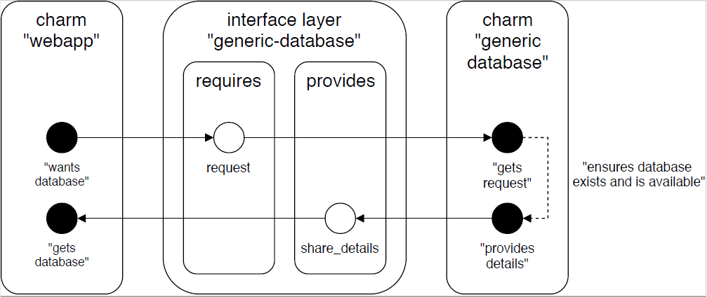

# Juju Roadmap

## TODOS (temp)

- Add explenation to the code


## Overview

- Introduction
- Requirements
- Goal
- Design
- In depth logic
- Full implementation
- Caveats
- Conclusion


## Introduction

This guide is meant for people who want to start writing charms in the application modelling tool Juju. The reactive framework, the Endpoint pattern and interface layers provide an excellent framework to work with. It isn't easy however for newcomers to find good examples or even clear documentation. Things become outdated very fast and some docs provide different insights. In addition, there is the Jujucharms website with information, the reactive framework documentation, the charmhelpers documentation and the charm store to explore. I've realised though that the best examples are found in github repositories of experienced users. Hang out in the irc #juju channel on freenode to find out more!

Tl;dr: This is a guide for charm authors to create charms in the reactive framework and with the use of the endpoint pattern.

## Requirements

No prior knowledge in terms of charms development is required but will come in handy. Knowledge about the [terms](https://docs.jujucharms.com/2.3/en/juju-concepts) used in juju and a basic understanding of [hooks and their lifecycles](https://docs.jujucharms.com/2.3/en/developer-event-cycle) are interesting lecture before continuing. [Getting started with charm development](https://docs.jujucharms.com/2.3/en/developer-getting-started) is another good place to start.

Furthermore I assume you:

- have a working Juju environment (bootstrapped and client so that you can deploy charms, create models, ...)
- setup a JUJU_REPOSITORY directory (see [creating a new layer](https://docs.jujucharms.com/2.3/en/developer-getting-started#creating-a-new-layer) for help)
- installed Python 3.x as this is the language in the reactive framework
- installed [Charm Tools](https://docs.jujucharms.com/2.3/en/tools-charm-tools)


## Goal

Time to tell what we are creating. Because I want to show an example of an interface layer I will be using multiple (layer) charms. In other words we will create two charms and one interface layer that connects them. To fully demonstrate (and reuse the project I'm working on a bit) we will create a charm that will act as proxy of another charm passing some information. This shows the working of the interface layers and illustrates how one can use existing charms as well.

The use case we will implement can be summarised as follows:

1. A requesting charm (this will be a webpage with the generated data running on top of a webserver ) -> Name = "webapp".
2. A proxy charm -> Name = "gdb-charm" (generic database charm).
3. The interface layer that connects the previous 2 charms -> Name = "proxy".
4. An existing charm and existing interface layer. -> Interface layer = "mysql-shared", charm = "mysql".

Making this a bit more concrete we will make sure the following thing works. This is in other words the lifecycle/workflow from an operations perspective when setting up the charms/services. 

1. The webapp performs a request to the gdb-charm.
2. The gdb-charm recieves the request and proxies this to the mysql charm using the (existing) mysql-shared interface.
3. The (existing) mysql charm configures a database and shares the details with the gdb-charm.
4. The gdb-charm receives the connection details from the mysql charm and proxies it to the webapp.
5. The webapp receives the details and renders a page with this information.


## Design

The application model will look like this:




## In depth logic

In this section we will look at the steps defined under goal. They summarise what the layers must do. Before looking at the code let's make the charms. Use the ``charm build`` command or create the folder and files manually. Take a look at the github repository and look at the files if the structure is giving you problems.


## Implementation

Make sure the following files are configured as follows as shown on the following image.



The two charms are connected through the proxy interface layer and both charms use the apache layer to setup apache and deploy the adminer.php page. The gdb-charm also uses the existing mysql-shared interface. 

The heart of the use case lies in the reactive folder. This is also the focus of this guide. To keep things clear the titles will always indicate what file and what layer (charm layers or interface layer) are meant. Keep in mind that a lot of stuff is left behind for the sake of clarity. Take a look at the repository for a full implementation. The first thing to know is how interface layer works. Look at the following figure.



Notice how the interface layers has a provides and a requires side depending on where you are in the workflow and from which point of view you are looking. This might seem confusing, or you might swap them around (I sure did at first) but with the previous figure in mind it helps knowing what happens where.

In our use case there will be four files of importance. The reactive framework file of the testwebapp (reactive/testwebapp.py) and the file of the gdb-charm (reactive/gdb-charm.py) are both important to create the charm layer. In the interface layer there is a requires.py and a provides.py. Do note that the interface layer also has an interface.yaml which looks like:

```yaml
name: proxy
summary: Example interface that proxies mysql data
maintainer: Ciberth
```

This is important for the name of the interface! Now let's get started. Let's first take a look at the requesting service, in this the testwebapp.

### Testwebapp (testwebapp/reactive/testwebapp.py)


```python

@when('endpoint.database.joined')
@when_not('endpoint.database.connected')
def request_mysql_db():
    endpoint = endpoint_from_flag('endpoint.database.joined')
    endpoint.request('mysql', 'mydbname', 'myuser')
    status_set('maintenance', 'Requesting mysql gdb')


```


### Interface-layer requires (proxy/requires.py)

```python
class GenericDatabaseClient(Endpoint):

    @when('endpoint.{endpoint_name}.changed')
    def _handle_technology_available(self):
        if self.technology():
            set_flag(self.expand_name('endpoint.{endpoint_name}.available'))

    def request(self, technology, databasename, username):
        for relation in self.relations:
            relation.to_publish['technology'] = technology
            relation.to_publish['databasename'] = databasename
            relation.to_publish['username'] = username

    def databasename(self):
        return self.all_joined_units.received['dbname']

    # same thing for host, port, user, password
```


### Gdb-charm (gdb-charm/reactive/gdb-charm.py)

```python
@when('mysql.connected', 'endpoint.database.mysql.requested')
def request_mysql_db():
    db_request_endpoint = endpoint_from_flag('endpoint.database.mysql.requested')

    databasename = db_request_endpoint.databasename()
    username = db_request_endpoint.username()

    mysql_endpoint = endpoint_from_flag('mysql.connected')
    mysql_endpoint.configure(databasename, username, prefix="gdb")

    status_set('maintenance', 'Requesting mysql db')


@when('mysql.available', 'endpoint.database.mysql.requested')
def render_mysql_config_and_share_details():  
 
    mysql_endpoint = endpoint_from_flag('mysql.available')

    # On own apache
    render('gdb-config.j2', '/var/www/generic-database/gdb-config.html', {
        'db_master': "no-master",
        'db_pass': mysql_endpoint.password("gdb"),
        'db_dbname': mysql_endpoint.database("gdb"),
        'db_host': mysql_endpoint.db_host(),
        'db_user': mysql_endpoint.username("gdb"),
        'db_port': "3306",
    })

    # share details to consumer-app
    gdb_endpoint = endpoint_from_flag('endpoint.database.mysql.requested')
    
    gdb_endpoint.share_details(
        "mysql",
        mysql_endpoint.db_host(),
        mysql_endpoint.database("gdb"),
        mysql_endpoint.username("gdb"),
        mysql_endpoint.password("gdb"),
        "3306",
    )
    
    clear_flag('endpoint.database.mysql.requested')
    set_flag('endpoint.database.mysql.available')
    set_flag('endpoint.database.concrete')
    set_flag('restart-app')
```

### Interface-layer provides (proxy/provides.py)

```python
class GenericDatabase(Endpoint):

    @when('endpoint.{endpoint_name}.joined')
    def _handle_joined(self):
        technology = self.all_joined_units.received['technology']
        dbname = self.all_joined_units.received['dbname']
        if technology:
            flag_t = 'endpoint.{endpoint_name}.' + technology + '.requested'
            set_flag(self.expand_name(flag_t))
        if dbname:
            flag_d = 'endpoint.{endpoint_name}.' + dbname + '.requested'
            set_flag(self.expand_name(flag_d))

    def technology(self):
        return self.all_joined_units.received['technology']

    def databasename(self):
        return self.all_joined_units.received['databasename']

    def username(self):
        return self.all_joined_units.received['username']

    def share_details(self, technology, host, dbname, user, password, port):
        for relation in self.relations:
            relation.to_publish['technology'] = technology
            relation.to_publish['host'] = host
            relation.to_publish['dbname'] = dbname
            relation.to_publish['user'] = user
            relation.to_publish['password'] = password
            relation.to_publish['port'] = port
```

### Testwebapp (testwebapp/reactive/testwebapp.py)


```python

@when('endpoint.database.available')
def mysql_render_config():
    
    mysql = endpoint_from_flag('endpoint.database.available')

    render('database-config.j2', '/var/www/testwebapp/database-config.html', {
        'gdb_host' : mysql.host(),
        'gdb_port' : mysql.port(),
        'gdb_dbname' : mysql.databasename(),
        'gdb_user' : mysql.user(),
        'gdb_password' : mysql.password(),
    })
    status_set('maintenance', 'Rendering config file')
    set_flag('endpoint.database.connected')
    set_flag('restart-app')

```


## Caveats and Conclusion

This guide showed an example on how to create reactive charms and use the endpoint pattern. Note that the service created here is not full-fledged as the webapp did not receieve the rights to properly access the database. The goal was however to show how to share data over the relations and illustrate how interface layers function as proper APIs for the communication between charms. I hope you liked this short introduction, best of luck in building your charms!